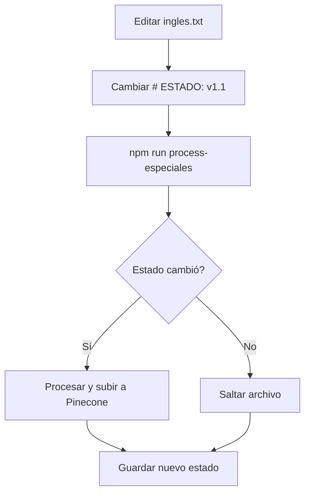

# Sistema de Casos Especiales - Guía Rápida

## 🎯 ¿Qué es esto?

Sistema para agregar información específica y actualizable a la base de conocimiento sin necesidad de redeployar. Ideal para cursos con horarios que cambian frecuentemente.

## 📝 Uso Rápido

### 1. Crear/Editar Archivo

```bash
# Abrir archivo de inglés
nano documents/casos-especiales/ingles.txt
```

### 2. Actualizar ESTADO (IMPORTANTE)

```txt
# ESTADO: v1.0  →  # ESTADO: v1.1  ← CAMBIAR ESTO
# FECHA_ACTUALIZACION: 2025-11-04
# DESCRIPCION: Información de cursos de inglés

[... contenido ...]
```

### 3. Procesar

```bash
npm run process-especiales
```

## ✅ Resultado

El script:

- Detecta que cambió el estado (v1.0 → v1.1)
- Procesa el archivo
- Sube los chunks a Pinecone
- Guarda el nuevo estado

La próxima vez que ejecutes `npm run process-especiales`, si el estado no cambió, NO reprocesa (eficiente).

## 🔄 Workflow Completo



## 📁 Archivos Actuales

- `ingles.txt` - Cursos de inglés (IDIOMA INGLÉS, CONVERSATION CLUB, ADVANCED CONVERSATION CLUB)

## 💡 Tips

1. **Siempre incrementa el ESTADO** cuando hagas cambios
2. **Formato consistente** ayuda al RAG a entender mejor
3. **Incluye contactos** para que el usuario pueda consultar más detalles
4. **Usa secciones claras** con separadores (===, ---)

## 🚀 Integrar en Deploy Automático

Agrega al `deploy.sh` antes de construir la imagen:

```bash
# Procesar casos especiales
echo "📋 Procesando casos especiales..."
npm run process-especiales
```

Así siempre se actualizará la base de conocimiento antes de desplegar.
